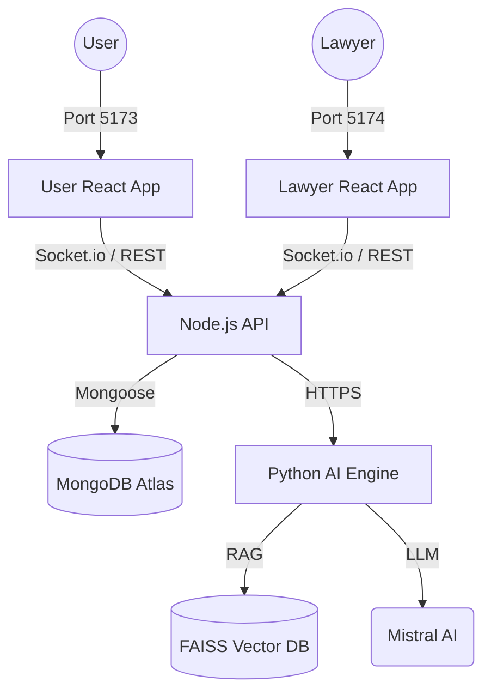

# ⚖️ JurisBot — Premium AI Legal Assistant & SaaS Platform

**JurisBot** is a production-grade, full-stack SaaS ecosystem designed to democratize legal intelligence. It combines modern Web 3.0 aesthetics with advanced AI Retrieval-Augmented Generation (RAG) to provide grounded legal advice and direct, real-time access to professional advocates.

---

## 🌟 Platform Overview

JurisBot is divided into two specialized workspaces, seamlessly connected by a high-speed real-time engine:

### 🏙️ 1. Citizen Portal (User Frontend)
*   **AI Legal Assistant:** 24/7 IPC-grounded chat with multi-language support (Tamil, Hindi, Telugu, Malayalam, English).
*   **Case Filing Suite:** A simplified multi-step workflow for citizens to submit legal matters.
*   **Consultation Hub:** Private chat channels with matched lawyers featuring full message history.
*   **Global Video Notifications:** Integrated "Expert Calling" alerts that appear regardless of which page the user is viewing.

### 👨‍⚖️ 2. Professional Workspace (Lawyer Frontend)
*   **Executive Dashboard:** Real-time analytics for active clients, pending requests, and legal files.
*   **Queue Management:** One-click acceptance/rejection of citizen consultation requests.
*   **Secure Consultation Console:** A dedicated, premium workspace for handling cases and chatting with clients.
*   **Video Consultation Suite:** Peer-to-peer video calling with camera/mic controls and session metadata.

### 🛠️ 3. Regulatory Control (Admin Dashboard)
*   **Platform Analytics:** Global oversight of user growth, lawyer registrations, and emergency frequency.
*   **Knowledge Base Management:** Direct PDF uploads for law codes with automatic AI vector indexing.

---

## 🏗️ Technical Architecture



---

## 💻 Tech Stack

| Component | Technology |
| :--- | :--- |
| **User Interface** | React 18, Vite, CSS3 (Glassmorphism), Google Fonts (Outfit, Cormorant) |
| **Logic & State** | Context API, Axios, React Router 6 |
| **Real-Time Engine** | Socket.IO (Signaling & Notifications) |
| **Backend Core** | Node.js, Express, JWT, Multer |
| **AI Infrastructure** | Python 3.9+, Flask, FAISS, Sentence-Transformers, Ollama |
| **Storage** | MongoDB Atlas, Local PDF Vault |

---

## 🚀 Installation & Setup

### 1. Prerequisites
- **Node.js** (v18+)
- **Python** (3.9+)
- **MongoDB** (Local or Atlas)
- **Ollama** (Ensure `mistral` model is pulled)

### 2. Backend Initialization
```bash
cd backend
npm install
# Configure your .env:
# MONGO_URI=your_uri
# JWT_SECRET=your_secret
# PORT=5000
npm start
```

### 3. AI Service (RAG Engine)
```bash
cd backend/ai-service
pip install -r requirements.txt
python app.py
```

### 4. Running the Portals
**User Portal:**
```bash
cd frontend
npm install
npm run dev # Runs on http://localhost:5173
```

**Lawyer Portal:**
```bash
cd lawyer-frontend
npm install
npm run dev # Runs on http://localhost:5174
```

---

## 🔑 Seeding Default Data
To quickly populate the platform for a demonstration:

```bash
# Go to /backend
node seed_admin.js   # Admin: nishal-admin@jurisbot.com / admin123
node seed_lawyer.js  # Lawyer: nishal@jurisbot.com / password123
```

---

## 🌍 Real-Time Communication Workflow

1.  **Discovery:** Citizen finds Lawyer Nishal and requests a consultation.
2.  **Acceptance:** Lawyer receives a notification on their dashboard and accepts.
3.  **Messaging:** Both parties enter a private chat where history is persisted via MongoDB.
4.  **Expert Call:** Lawyer clicks the 📹 icon. 
    *   A `video-call-request` event is emitted.
    *   The User sees a popup: **"Expert Nishal is calling..."**.
5.  **Consultation:** Both enter the `/video/:roomId` room to conduct the session.

---

## 📄 License & Design
Designed for the **Indian Legal Ecosystem**. Developed with a focus on trust, accessibility, and professional excellence.

**JurisBot — Empowering every citizen with the power of the law.**
