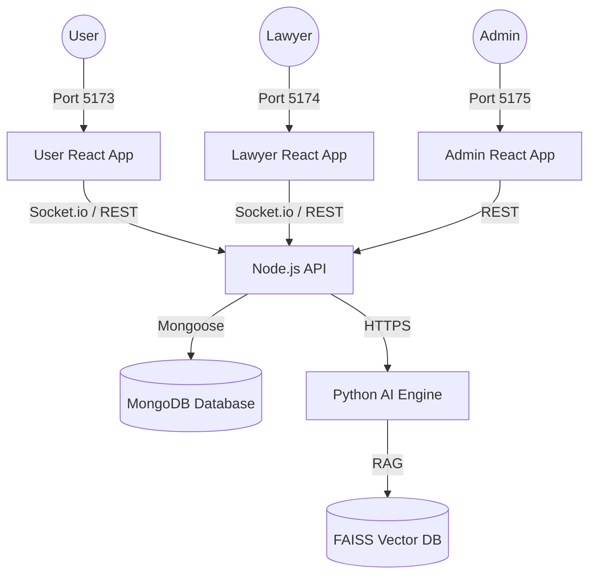

# ⚖️ JurisBot — Premium AI Legal Assistant & SaaS Platform

**JurisBot** is a production-grade, full-stack SaaS ecosystem designed to democratize legal intelligence. It combines modern Web 3.0 aesthetics with advanced AI Retrieval-Augmented Generation (RAG) to provide grounded legal advice and direct, real-time access to professional advocates.

---

## 🌟 Platform Overview

JurisBot is divided into three specialized workspaces, completely overhauled with a unified, enterprise-grade dark glassmorphic design system:

### 🏙️ 1. Citizen Portal (User Frontend)
*   **AI Legal Assistant:** 24/7 IPC-grounded chat with multi-language support (Tamil, Hindi, Telugu, Malayalam, English). Features a new premium, floating chat interface.
*   **Case Filing Suite:** A guided, dark-mode multi-step wizard for citizens to submit legal matters securely.
*   **Consultation Hub:** Private chat channels with matched lawyers featuring full message history.
*   **Secure Video Consultation:** Integrated "Expert Calling" alerts drop citizens into the *JurisVault*, a military-grade encrypted video wrapper.

### 👨‍⚖️ 2. Professional Workspace (Lawyer Frontend)
*   **Executive Dashboard:** Completely redesigned with Kanban-style glass cards featuring glowing priority badges (Emergency, High, Normal).
*   **Queue Management:** One-click acceptance/rejection of citizen consultation requests directly from the Case Cards.
*   **Secure Consultation Console:** A dedicated, premium workspace for handling cases and chatting with clients.
*   **Video Consultation Suite:** Peer-to-peer secure video calling with a synchronized "Live Timer" and professional lawyer metadata.

### 🛠️ 3. Regulatory Control (Admin Dashboard)
*   **Platform Analytics:** Global oversight of user growth, lawyer registrations, and emergency frequency.
*   **Knowledge Base Management:** Direct PDF uploads for law codes with automatic AI vector indexing.

---

## 🏗️ Technical Architecture


```mermaid
graph TD
    User((User)) -->|Port 5173| Frontend[User React App]
    Lawyer((Lawyer)) -->|Port 5174| ExpertApp[Lawyer React App]
    Admin((Admin)) -->|Port 5175| AdminApp[Admin React App]
    Frontend -->|Socket.io / REST| Backend[Node.js API]
    ExpertApp -->|Socket.io / REST| Backend
    AdminApp -->|REST| Backend
    Backend -->|Mongoose| Atlas[(MongoDB Database)]
    Backend -->|HTTPS| AI[Python AI Engine]
    AI -->|RAG| FAISS[(FAISS Vector DB)]
```

---

## 💻 Tech Stack

| Component | Technology |
| :--- | :--- |
| **User Interface** | React 18, Vite, CSS3 (Glassmorphism), Google Fonts (Playfair Display, Inter) |
| **Logic & State** | Context API, Axios, React Router 6 |
| **Real-Time Engine** | Socket.IO (Signaling & Notifications) |
| **Backend Core** | Node.js, Express, JWT, Multer |
| **AI Infrastructure** | Python 3.9+, Flask, FAISS, Sentence-Transformers, NVIDIA NIM Integration |
| **Storage** | Document Database, Local PDF Vault |

---

## 🚀 Installation & Setup

### 1. Prerequisites
- **Node.js** (v18+)
- **Python** (3.9+)
- **Database Environment** (MongoDB instance required)

### 2. Backend Initialization
```bash
cd backend
npm install
# Ensure you configure your environment variables securely in a .env file
npm start
```

### 3. AI Service (RAG Engine)
```bash
cd backend/ai-service
pip install -r requirements.txt
python app.py
```

### 4. Running the Portals
**User Portal:**
```bash
cd frontend
npm install
npm run dev # Runs on http://localhost:5173
```

**Lawyer Portal:**
```bash
cd lawyer-frontend
npm install
npm run dev # Runs on http://localhost:5174
```

**Admin Portal:**
```bash
cd admin-frontend
npm install
npm run dev # Runs on http://localhost:5175
```

---

## 🌍 Real-Time Communication Workflow

1.  **Discovery:** Citizen finds a Lawyer and requests a consultation.
2.  **Acceptance:** Lawyer receives a notification on their Kanban dashboard and accepts.
3.  **Messaging:** Both parties enter a private chat where history is persisted securely.
4.  **Expert Call:** Lawyer clicks the Consultation icon. 
    *   A `video-call-request` event is emitted over WebSocket.
    *   The User sees a popup: **"Expert is calling..."**.
5.  **JurisVault:** Both enter the highly secure `JurisVault` video room to conduct the session.

---

## 📄 License & Design
Designed for the **Indian Legal Ecosystem**. Developed with a focus on trust, accessibility, and professional enterprise excellence.

**JurisBot — Empowering every citizen with the power of the law.**
